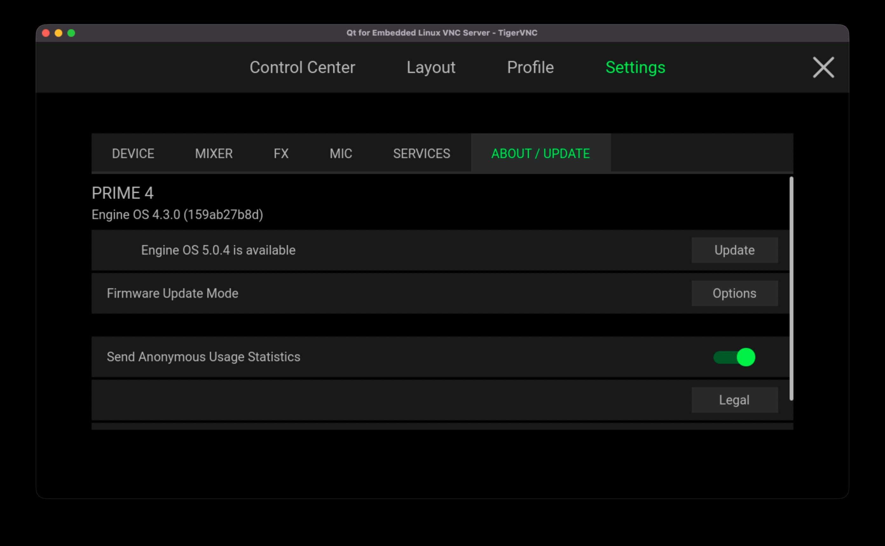
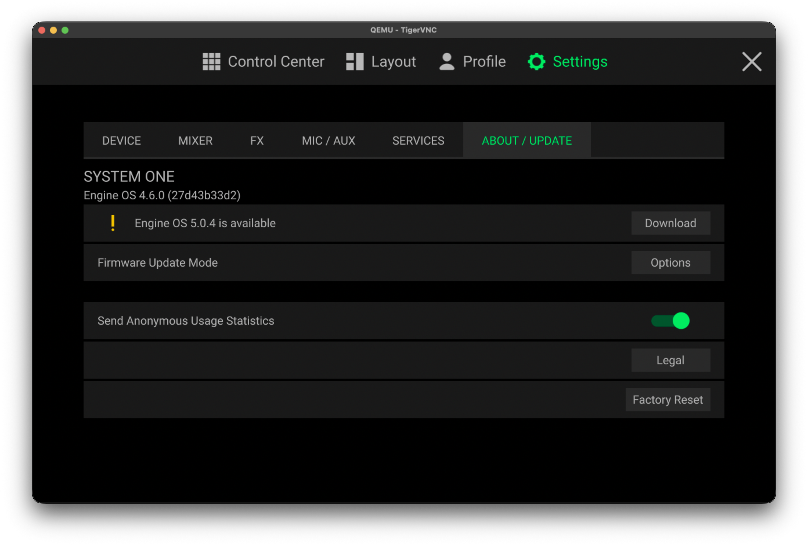
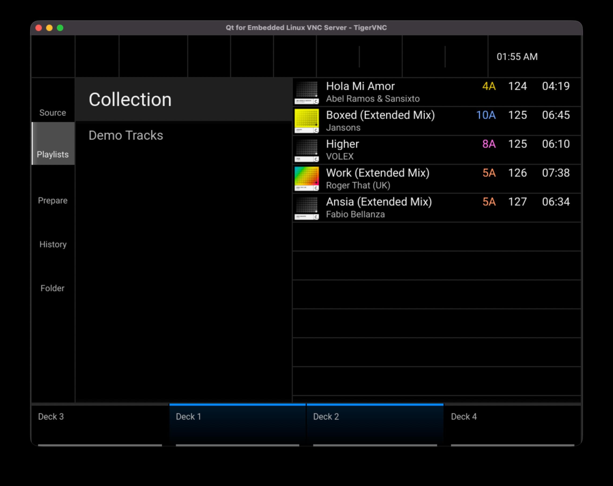
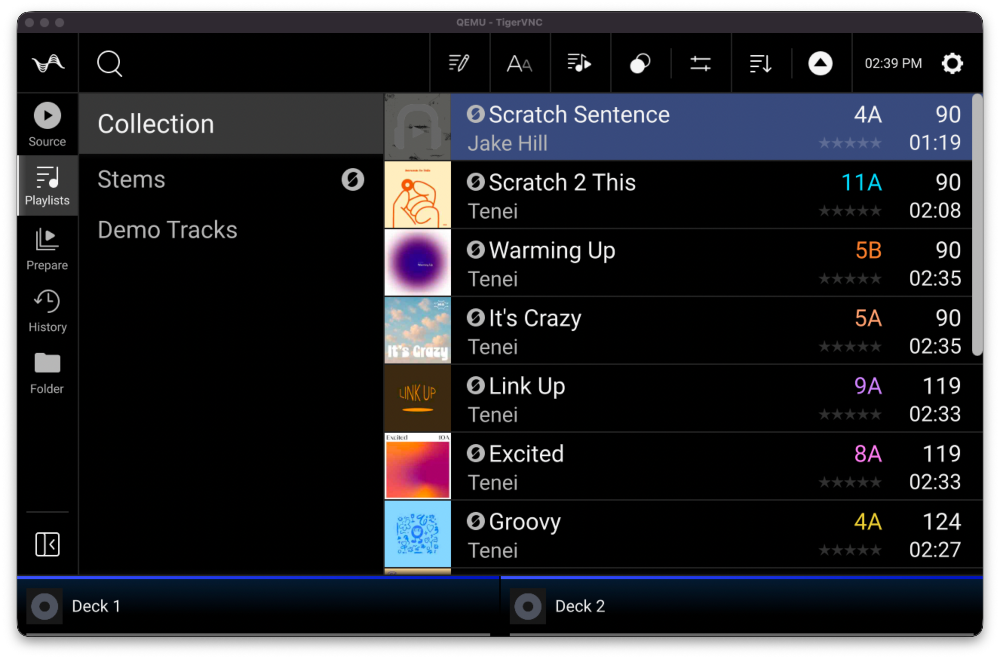

# QEngine - Engine OS Emulator
Emulate Engine OS and other InMusic OSes inside QEMU

**NOTE:** Docs are currently **awful**, they will be better eventually. Basic docs for setting up arn64 emulation are [here.](scripts/build_scripts/BUILD_ARM64.md)

## Documentation
- [BUILDING.md](docs/BUILDING.md) — building/assembling and booting an Engine OS image under QEMU
- [ENGINEOS.md](docs/ENGINEOS.md) — Engine OS internals, product spoofing, known limitations
- [BLOCKING_TELEMETRY.md](docs/BLOCKING_TELEMETRY.md) — stopping Engine's crash/analytics reporting from reaching InMusic's real Sentry project
- [BUILD_ARM64.md](scripts/build_scripts/BUILD_ARM64.md) / [BUILD_MPC.md](scripts/build_scripts/BUILD_MPC.md) — what each device family needs
- [INSTANCES.md](scripts/build_scripts/INSTANCES.md) — running several emulated devices side by side

## Quick setup

Verified from an empty `build/` on x86_64 Linux. The same commands work on an arm64
Linux host or an Apple Silicon Mac, where the launchers pick up KVM/HVF instead of
falling back to TCG.

**Prerequisites:** `docker`, `qemu-system-aarch64` and `qemu-system-arm`, `binwalk`
3.1.x, `e2fsprogs` (for `dumpe2fs`, `debugfs`, `resize2fs`), `file`.

```sh
# 1. Kernels. Once per architecture — these are generic Debian kernels, shared by
#    every instance of that architecture, so this step is not repeated per device.
scripts/build_scripts/get_arm64_kernel.sh     # ~7 min   Engine OS  / RK3588
scripts/build_scripts/get_armv7_kernel.sh     # ~2 min   Akai MPC   / RK3288

# 2. One instance per device + firmware version. Point --firmware straight at an
#    update image; there is no firmware directory to populate.
scripts/build_scripts/new_instance.sh --name rmz2-4.6.0 --device engine \
    --firmware /path/to/SYSTEMONE-4.6.0-Update.img                    # ~1 min

scripts/build_scripts/new_instance.sh --name mpc-3.9.1 --device mpc \
    --firmware /path/to/MPC-3.9.1-Gen1-update.img                     # ~1 min

# 3. Boot. Each instance owns its disks and its host ports, so these run at the
#    same time without interfering.
scripts/qemu/run_instance.sh --name rmz2-4.6.0
scripts/qemu/run_instance.sh --name mpc-3.9.1
scripts/qemu/run_instance.sh --list
```

The serial console appears in the terminal you launched from and root has no
password. On x86_64 the guest is emulated rather than virtualized — KVM cannot
accelerate a foreign architecture — so allow roughly two minutes to a login prompt.

**Picking the right firmware.** `--device mpc` means the armv7 / RK3288 MPC family
(product codes `ACV*`). Akai also ships an arm64 "Gen 2" MPC image; that one belongs
to a different pipeline, and the build now rejects it up front rather than producing
an image that panics partway into boot.

**Build one architecture at a time.** Both pipelines use the same `debian:bookworm`
and `debian:trixie` tags at different architectures, and Docker caches a tag at only
one architecture at a time, so building an arm64 and an armv7 target concurrently
will fight over them. Sequentially is fine — each build pulls what it needs.

In the MPC guest, failing units for LoadPin verity trustpoints, AZ0x system info
logging and XMOS USB audio firmware are expected: none of that hardware exists here.

## Engine OS Support Matrix
|                         | 5.0.4 (arm64) | 5.0.4 (armv7) | 4.6.0 | 4.3.0 |
|-------------------------|---------------|---------------|-------|-------|
| Rootfs Extraction       | Y             | Y             | Y     | Y     |
| Engine                  | Y             | ?             | Y     | Y     |
| SoundSwitch             | Y             | ?             | Y     | N     |
| Native Display          | Y             | ?             | Y     | N     |
| QT VNC Display          | N             | ?             | N     | Y     |
| Fake Touch              | Y             | ?             | Y     | Y     |
| Keyboard Navigation     | Y             | ?             | Y     | Y     |
| Audio Playback          | Y             | ?             | Y     | N     |
| MIDI                    | Y             | ?             | Y     | ~     |
| External Media (USB/SD) | Y             | ?             | Y     | N     |

## Emulated Controllers
|                         | SOC    | Signed FW | Arch  | 5.0.4 | 4.6.0 | 4.3.0 |
|-------------------------|--------|-----------|-------|-------|-------|-------|
| Denon DJ Prime 2        | RK3288 | N         | armv7 | ?     | N/A   | ?     |
| Denon DJ Prime 4        | RK3288 | N         | armv7 | ?     | N/A   | Y     |
| Denon DJ Prime 4+       | RK3288 | Y         | armv7 | ?     | N/A   | ?     |
| Denon DJ Prime GO       | RK3288 | N         | armv7 | ?     | N/A   | !     |
| Denon DJ Prime GO+      | RK3288 | Y         | armv7 | ?     | N/A   | ?     |
| Denon DJ SC5000 Prime   | RK3288 | N         | armv7 | ?     | N/A   | ?     |
| Denon DJ SC5000M Prime  | RK3288 | N         | armv7 | ?     | N/A   | ?     |
| Denon DJ SC6000 Prime   | RK3288 | N         | armv7 | ?     | N/A   | ?     |
| Denon DJ SC6000M Prime  | RK3288 | N         | armv7 | ?     | N/A   | ?     |
| Denon DJ SC Live 2      | RK3288 | Y         | armv7 | ?     | N/A   | ?     |
| Denon DJ SC Live 4      | RK3288 | Y         | armv7 | ?     | N/A   | ?     |
| Numark Mixstream Pro    | RK3288 | Y         | armv7 | ?     | N/A   | ?     |
| Numark Mixstream Pro+   | RK3288 | Y         | armv7 | ?     | N/A   | ?     |
| Numark Mixstream Pro GO | RK3288 | Y         | armv7 | ?     | N/A   | ?     |
| RANE SYSTEM ONE         | RK3588 | Y         | arm64 | Y     | Y     | N/A   |

| Denon DJ Prime 4 | RANE SYSTEM ONE |
|------------------|-----------------|
|  |  |
|  |  |
